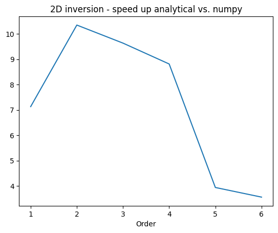

# Fast inversion of DGSEM blocks
This repository provides a `python` implementation and performance analysis of the inversion strategies for diagonal dense blocks resulting from DGSEM (Discontinuous Galerkin Spectral Element Methods) proposed in paper "_Maximum principle preserving time implicit DGSEM for linear scalar hyperbolic conservation laws_" by Milani, Renac, and Ruel [MRR].

The repository contains three files:
* [**`fast_DGSEM_block_inversion.py`**](fast_DGSEM_block_inversion.py): This `python` module provides the actual implementation of inversion strategies [MRR, (45)] and [MRR, Algorithm 1]. Caution has been paid to reference the function of the module with the equations of the above-mentioned paper. Secondly, the module also contains versions of standard matrix operations optimized for diagonal matrices. The only dependency is `numpy` which is also used as reference resolution method to which the optimized strategies are compared
* [**`test_fast_DGSEM.py`**](test_fast_DGSEM.py): a `pytest` framework checking the exactness of the optimizations provided by `fast_DGSEM_block_inversion.py`
* [**`test_fast_DGSEM.ipynb`**](test_fast_DGSEM.ipynb): `jupyter` notebook comparing the proposed fast inversion strategies [MRR, (45)] and [MRR, Algorithm 1] to the reference `numpy` ones both in terms of exactness and performances. Concerning this latter subject, performances analyses have been carried out with `timeit`. The results (see those obtained for a run on a personal machine with 8 Intel Xeon(R) W-2223 CPUs and 16Gb RAM) suggest that the proposed inversions strategies are consistently and often significantly (up to more than ten times more) faster than the reference ones.

    

    

The main module only depends on `numpy`, the testing framework on `pytest`, and the notebook on `pandas`.
